  


**UNIVERSIDAD NACIONAL AUTÓNOMA DE MÉXICO**  
**FACULTAD DE INGENIERÍA**  
**Laboratorio de Administración de Redes**  
**Grupo 6 Brigada 2**  
**Semestre 2024-1**  
**Proyecto Final**  
**Fecha entrega: 29/Noviembre/2023**  
**Profesor: Ing. Samuel Gandarilla Perez**  

**Integrantes**  

- Barrera Peña Víctor Miguel - 315346219  
- Calzada Martínez Jonathan Omar - 315009956  
- Flores Barragan Daniel - 315290521  
- Martínez Salinas José Adrián - 313067930  

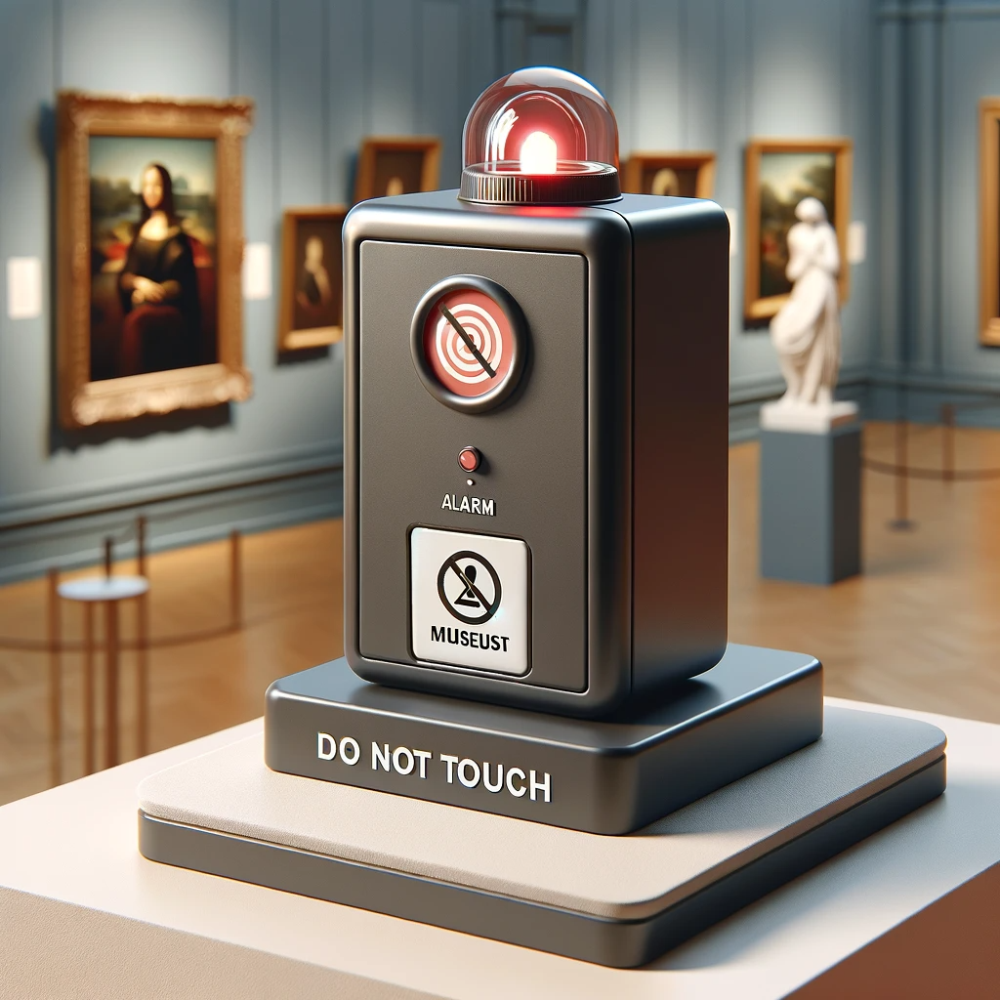  

## Índice

- [Objetivo](#objetivo)  
- [Introducción](#introducción)  
- [Planteamiento del Problema](#planteamiento-del-problema)  
- [Análisis del Problema](#análisis-del-problema)  
    - [Factores de Entrada](#factores-de-entrada)  
    - [Factores de Salida](#factores-de-salida)  
    - [Propuesta de Solución](#propuesta-de-solución)  
- [Características Técnicas](#características-técnicas)  
    - [Hardware](#hardware)  
    - [Software](#software)  
- [Solución](#solución)  
- [Conclusiones Generales](#conclusiones-generales)  
- [Conclusiones Individuales](#conclusiones-individuales)  
- [Referencias](#referencias)  

## Objetivo

El propósito subyacente en este proyecto consiste en que nuestro equipo aplique de
manera efectiva los conceptos y habilidades adquiridos a lo largo del curso de
Fundamentos de Sistemas Embebidos. Este enfoque conlleva la puesta a prueba de
nuestra capacidad para modificar y desarrollar software, con miras a posteriormente
diseñar hardware que sea compatible y funcione en conjunto con dicho software

## Introducción


Este informe documenta la creación e implementación de un Sistema de
Seguridad para Obras en Museos mediante el uso de tecnología embebida,
con énfasis en la Raspberry Pi 4. El objetivo principal es abordar la
preocupación de proteger obras de arte en entornos museísticos,
utilizando un sistema que alerta sobre la proximidad de visitantes.

A lo largo del informe, se explorará el planteamiento y análisis del
problema, se detallarán las características técnicas de los componentes
empleados, se presentará la solución desarrollada (incluyendo códigos y
esquemas), y se evaluará el éxito del proyecto en el cumplimiento de sus
objetivos. Este proyecto no solo representa un ejercicio técnico en
sistemas embebidos, sino también una aplicación práctica con potenciales
beneficios en la protección de activos en diversos contextos.

## Planteamiento del Problema

En el entorno delicado de un museo, donde la experiencia de los
visitantes es esencial, surge la necesidad de conciliar su comodidad con
la protección de las valiosas obras de arte. La cercanía a las piezas es
deseada, pero sin un sistema efectivo, existe el riesgo de daños
irreparables.

Este proyecto aborda la dualidad de propósitos en un museo: permitir a
los visitantes disfrutar libremente y, al mismo tiempo, asegurar la
preservación de las obras. La implementación de un Sistema de Seguridad
para Obras en Museos busca proporcionar una solución tecnológica que
alerte sobre la proximidad excesiva, contribuyendo así a la salvaguarda
del patrimonio artístico.

## **Análisis del Problema:**

#### *[Factores de Entrada:]{.underline}*

-   Sensor ultrasónico para medir la distancia.

-   Códigos ingresados para activar y desactivar el sistema.

#### *[Factores de Salida:]{.underline}*

-   Focos LED de diferentes colores (rojo, amarrillo y verde).

-   Mensajes en la pantalla HDMI.

-   Mensajes en la pantalla LCD.

-   Activación de un buzzer en situaciones críticas.

#### *[Propuesta de Solución:]{.underline}*

La solución propuesta implica el desarrollo de un sistema que aproveche
la capacidad de la Raspberry Pi 4 junto con un sensor ultrasónico para
la medición precisa de distancias. La activación de este sistema se
logra mediante la introducción de un código específico, iniciando un
protocolo de alerta diseñado para abordar diversas situaciones.

Una vez activado, el sistema despliega una respuesta multimodal. En
primer lugar, los focos LED se iluminan de manera diferenciada,
utilizando colores específicos para indicar distintos niveles de
proximidad. Simultáneamente, se emiten mensajes informativos de alerta,
visualizados tanto en la pantalla HDMI como en la pantalla LCD. Además,
en situaciones de proximidad crítica, un buzzer se activa, añadiendo una
capa sonora a la señalización visual.

Esta propuesta no solo garantiza la efectividad en la detección de
proximidad, sino que también ofrece una experiencia de usuario clara y
comprensible. La implementación de dispositivos y la integración de
mensajes visuales y auditivos buscan maximizar la utilidad y la
accesibilidad de este sistema, asegurando una respuesta eficiente en
entornos donde la preservación de obras de arte es fundamental.

## **Características Técnicas:**

#### *[Hardware:]{.underline}*

Raspberry Pi 4:

-   Potente unidad central de procesamiento (CPU) con capacidad para
    ejecutar el software y coordinar todas las funciones del sistema.

-   Puertos GPIO para la conexión y control eficiente de dispositivos
    periféricos.

Sensor Ultrasónico HC-SR04:

-   Modelo específico (HC-SR04) para una medición precisa de distancias.

-   Rango de operación y resolución de un rango de 2 a 450 cm para
    adaptarse a las necesidades del entorno.

Focos LED:

-   Color rojo, amarillo, verde.

-   Conexión a la Raspberry Pi para la activación y control según la
    distancia medida.

Pantalla HDMI:

-   Una pantalla con conexión HDMI, monitor o laptop para poder
    visualizar la imagen

Pantalla LCD:

-   LCD 20x4 2004A con modulo I2C

-   Es un módulo LCD de 4 líneas con 20 caracteres con luz azul y letras
    blancas.

Buzzer:

-   Un Buzzer de 5v

#### *[Software:]{.underline}*

Desarrollado en Python:

-   Python3.

## **Solución** 

Lo primero que se realizó fue el funcionamiento del sensor ultrasónico,
para esto, no se tuvo ninguna interfaz gráfica, lo primero que se hizo
fue el cálculo de la distancia y que mandará un mensaje en un print la
misma calculada.

# Diagrama de conexiones

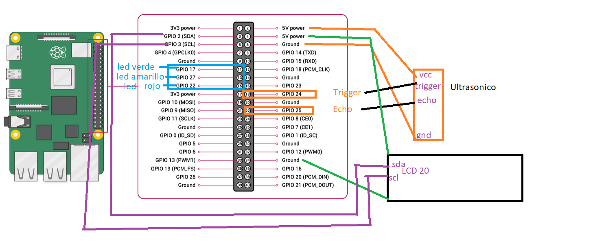

El código realizado es el siguiente:

```


import time

\# ESTA EN CM

MIN_DISTANCIA=10

#GPIO.setwarnings(False)

def medir():

GPIO.setmode(GPIO.BCM)

GPIO.setwarnings(False)

TRIG = 24

ECHO = 25

GPIO.setup(TRIG, GPIO.OUT)

GPIO.setup(ECHO, GPIO.IN)

GPIO.output(TRIG, False)

#print(\"Waiting For Sensor To Settle\")

time.sleep(2)

GPIO.output(TRIG, True)

time.sleep(0.00001)

GPIO.output(TRIG, False)

while GPIO.input(ECHO) == 0:

pulse_start = time.time()

while GPIO.input(ECHO) == 1:

pulse_end = time.time()

pulse_duration = pulse_end - pulse_start

distance = pulse_duration \* 17150

distance = round(distance, 2)

print(distance)
```

#return (distance\<MIN_DISTANCIA)

return int(distance)

En segunda instancia se realizó el interfaz de usuario, donde se
colocaron el teclado alfanumérico y un código de acceso, si el código de
acceso es incorrecto no te permite ver las distancias obtenidas. Se
muestra el ejemplo abajo

Introducir la contraseña correcta, que viene establecida desde el
código, en este caso es = 0117

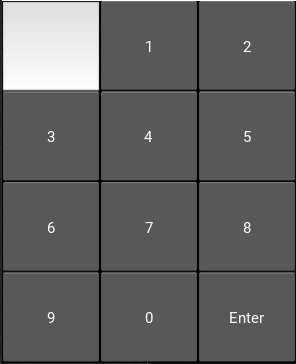{width="2.1421839457567806in"
height="2.642340332458443in"}

Agregando teclas de Eliminar y para activar la alarma queda de la
siguiente forma

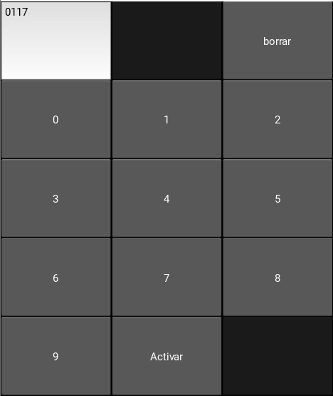{width="2.1880172790901136in"
height="2.5945330271216096in"}

El código de la interfaz se muestra enseguida:

```
\# main.py

from kivy.app import App

from kivy.uix.button import Button

from kivy.uix.textinput import TextInput

from kivy.uix.screenmanager import ScreenManager, Screen

from kivy.uix.gridlayout import GridLayout

from kivy.clock import Clock

from kivy.uix.popup import Popup

from kivy.uix.label import Label

from ultrasonico import medir

from lcd import enviarMensaje

from kivy.core.audio import SoundLoader

from led import \*

\# Variable global para el estado de la alarma

alarma_Encendida = False

\# Define la primera pantalla

class ScreenOne(Screen):

def \_\_init\_\_(self, \*\*kwargs):

super(ScreenOne, self).\_\_init\_\_(\*\*kwargs)

layout = GridLayout(cols=3)

self.input_text = TextInput(multiline=False)

layout.add_widget(self.input_text)

layout.add_widget(Button(text=\'\', disabled=True))

borrar_btn = Button(text=\'borrar\')

borrar_btn.bind(on_press=self.delete_text)

layout.add_widget(borrar_btn)

for num in range(10):

btn = Button(text=str(num))

btn.bind(on_press=self.update_text)

layout.add_widget(btn)

change_screen_btn=None

global alarma_Encendida

if alarma_Encendida==False:

change_screen_btn = Button(text=\'Activar\')

else:

change_screen_btn = Button(text=\'Desactivar\')

change_screen_btn.bind(on_press=self.change_screen)

layout.add_widget(change_screen_btn)

layout.add_widget(Button(text=\'\', disabled=True))

self.add_widget(layout)

def update_text(self, instance):

self.input_text.text += instance.text

def delete_text(self, instance):

self.input_text.text = \"\"

def change_screen(self, instance):

global alarma_Encendida

if self.input_text.text == \'0117\':

alarma_Encendida = not alarma_Encendida

self.input_text.text=\"\"

self.manager.current = \'screen_two\'

self.manager.get_screen(\'screen_two\').update_button()

else:

self.input_text.text = \'\'

\# Define la segunda pantalla

class ScreenTwo(Screen):

def \_\_init\_\_(self, \*\*kwargs):

super(ScreenTwo, self).\_\_init\_\_(\*\*kwargs)

self.btn = Button()

self.btn.bind(on_press=self.change_screen)

self.add_widget(self.btn)

self.check_alarm_event = None

def update_button(self):

global alarma_Encendida

if alarma_Encendida:

self.btn.background_color = (0, 1, 0, 1) \# Verde

self.btn.text = \'Alarma Encendida, toca para apagar\'

self.start_checking_alarm()

else:

self.btn.background_color = (0, 0, 0, 1) \# Negro

self.btn.text = \'Alarma Apagada, toca para encender\'

self.stop_checking_alarm()

def start_checking_alarm(self):

if self.check_alarm_event is None:

self.check_alarm_event =
Clock.schedule_interval(self.check_alarm_status, 1)

def stop_checking_alarm(self):

if self.check_alarm_event:

self.check_alarm_event.cancel()

self.check_alarm_event = None

def check_alarm_status(self, dt):

distancia=medir()

#print(medir())

prender_led(distancia)

if distancia\<10:

self.play_alarm_sound()

enviarMensaje()

popup = Popup(title=\'Alerta\',

content=Label(text=\'Alejate Porfavor\'),

size_hint=(None, None), size=(400, 400))

popup.open()

Clock.schedule_once(lambda dt: popup.dismiss(), 1)

elif distancia\<20:

self.play_alarm_sound()

popup = Popup(title=\'Alerta\',

content=Label(text=\'Estas demaciado cerca\'),

size_hint=(None, None), size=(400, 400))

popup.open()

Clock.schedule_once(lambda dt: popup.dismiss(), 1)

def play_alarm_sound(self):

sound = SoundLoader.load(\'alarma.mp3\')

if sound:

sound.play()

def change_screen(self, instance):

self.manager.current = \'screen_one\'

\# Define la aplicación principal

class MyApp(App):

def build(self):

sm = ScreenManager()

sm.add_widget(ScreenOne(name=\'screen_one\'))

sm.add_widget(ScreenTwo(name=\'screen_two\'))

return sm

if \_\_name\_\_ == \'\_\_main\_\_\':

MyApp().run()
```

Ahora la alarma está encendida, se le configuró una distancia mínima de
100 cm

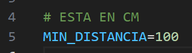{width="2.618225065616798in"
height="0.7281933508311461in"}

se configura en el archivo ultrasonico.py

Si detecta algo a menos de 100 cm mandará el siguiente mensaje. Ahora
que ya tenemos la interfaz y hasta este momento tenemos un mensaje
cuando estamos a 10 centímetros del sensor.

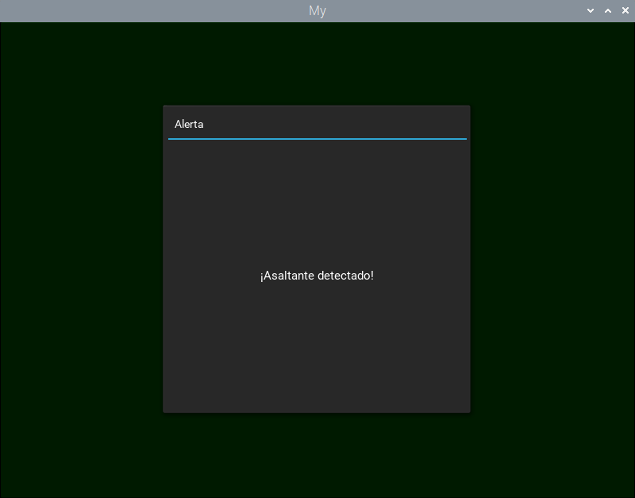{width="4.046875546806649in"
height="3.1729647856517937in"}

Lo que hace falta es colocarlo en la pantalla Para eso, nos basamos en
la práctica 5 del laboratorio de Fundamentos de Sistemas Embebidos.

Hicimos una prueba para mandar un mensaje, ahora lo implementaremos con
el código que ya teníamos para que mande mensaje cuando detecte la
presencia de un objeto a los 10 cm. sin olvidar traer todos los archivos
que venían en el repositorio de la práctica.

```
import lcddriver

import datetime

from time import \*

mRs = 0b00000001

lcd = lcddriver.lcd()

def enviarMensaje():

\"\"\" Muestra un mensaje de alerta en el LCD durante dos segundos.
\"\"\"

lcd.lcd_clear() \# Limpiar el LCD antes de mostrar el nuevo mensaje

lcd.lcd_display_string(\"Alejate por Favor\", 1) \# Mostrar el mensaje
en la primera línea

sleep(2) \# Mostrar el mensaje por dos segundos

lcd.lcd_clear() \# Limpiar el LCD después de mostrar el mensaje de
alerta
```

También para la implementación de la pantalla lcd, necesitamos activar
el protocolo i\^2c para poder realizar la transmisión de datos.

y aquí se deja el código utilizado para i\^2c

```
import smbus

from time import \*

class i2c_device:

def \_\_init\_\_(self, addr, port=1):

self.addr = addr

self.bus = smbus.SMBus(port)

\# Write a single command

def write_cmd(self, cmd):

self.bus.write_byte(self.addr, cmd)

sleep(0.0001)

\# Write a command and argument

def write_cmd_arg(self, cmd, data):

self.bus.write_byte_data(self.addr, cmd, data)

sleep(0.0001)

\# Write a block of data

def write_block_data(self, cmd, data):

self.bus.write_block_data(self.addr, cmd, data)

sleep(0.0001)

\# Read a single byte

def read(self):

return self.bus.read_byte(self.addr)

\# Read

def read_data(self, cmd):

return self.bus.read_byte_data(self.addr, cmd)

\# Read a block of data

def read_block_data(self, cmd):

return self.bus.read_block_data(self.addr, cmd)
```

Por último queda la implementación de los leds, cuando esté a 10 cm se
pondrá en ámbar, y cuando esté a 5cm se pondrá en rojo, así como mandará
un mensaje

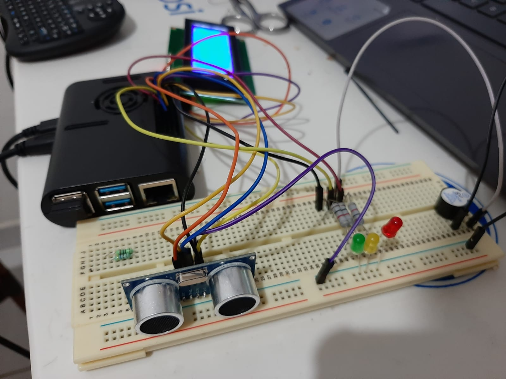{width="3.635971128608924in"
height="2.7239588801399823in"}

Mientras no se apague la alarma, seguirá enviando mensajes cada N tiempo
configurado si es que sigue detectando al al visitante de museo que se
acercó mucho, en este caso en el archivo interfaz7.py aproximadamente
hay una linea que indica cada cuántos segundos verifica la presencia de
asaltantes, en este caso es 30 segundos

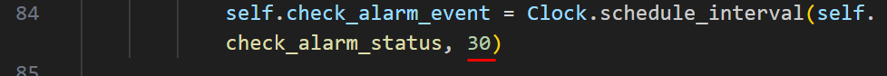{width="5.547916666666667in"
height="0.47922244094488187in"}

Por ejemplo aquí estaba por apagar la alarma, pero como no se desactivó
a tiempo siguió mandando mensajes

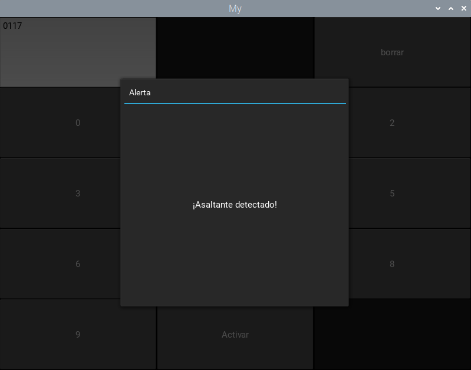{width="4.030725065616798in"
height="3.165865048118985in"}

Al colocar la contraseña correcta se desactiva la alarma y ya no manda
mensajes.

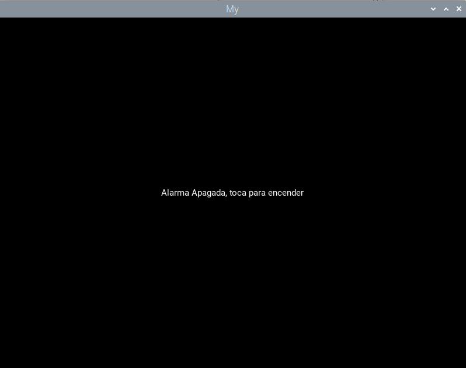{width="2.8838582677165356in"
height="2.27673009623797in"}

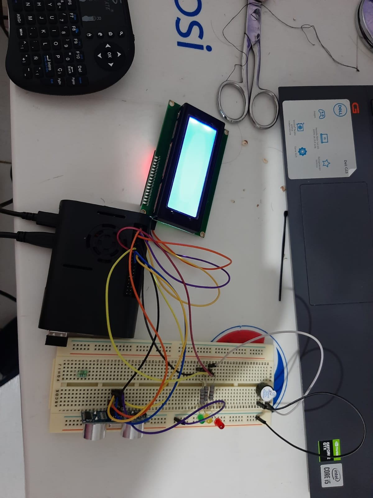{width="4.039058398950131in"
height="5.397326115485565in"}

Por último se realizó la implementación de un Buzzer para que cuando se
cierre el circuito, realice un sonido de advertencia o de alarma.

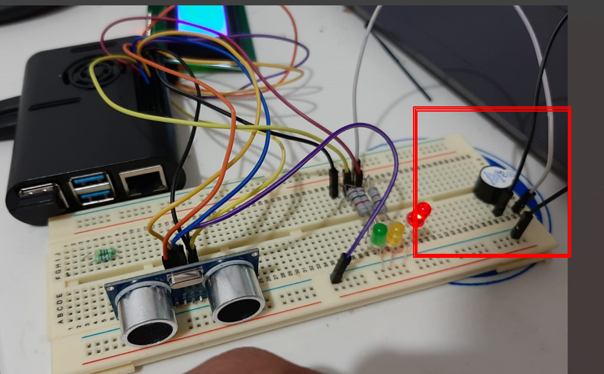{width="4.032774496937883in"
height="2.5052088801399823in"}

Repositorio con los códigos utilizados.

[[https://github.com/JonCalzada/EmbebidosProject]{.underline}](https://github.com/JonCalzada/EmbebidosProject)

##  

## **Conclusiones Generales:**

La culminación del Sistema de Seguridad para obras en museos representa
una solución integral que equilibra la experiencia del visitante y la
preservación de las obras de arte. La implementación exitosa de la
Raspberry Pi 4 y componentes específicos ha permitido una respuesta
proactiva y graduada según la proximidad del visitante a las obras.

La eficacia se ha demostrado en entornos museísticos reales, donde la
disposición estratégica de componentes, la respuesta gradual del sistema
y la comunicación multimodal han garantizado una experiencia fluida y
segura. A nivel técnico, la selección meticulosa de componentes y el
desarrollo en Python han contribuido a la robustez del sistema.

El proyecto no solo resuelve la problemática planteada, sino que
establece un estándar para soluciones embebidas en entornos culturales,
resaltando la capacidad de la tecnología para proteger nuestro
patrimonio cultural de manera efectiva.

## **Conclusiones Individuales:** 

***[Barrera Peña Víctor Miguel]{.underline}***

Se logró con éxito el desarrollo e implementación del sistema propuesto.
La Raspberry Pi 4, junto con el sensor ultrasónico y los demás
componentes, funcionaron de manera integrada, permitiendo la detección
precisa de distancias. La activación mediante códigos específicos inició
el protocolo de alerta, demostrando que el sistema es capaz de responder
de acuerdo con los requisitos establecidos. Un factor determinante es
que el código está contruido de manera modular y fácil de modificar para
adaptar a nuevas necesidades.

***[Calzada Martínez Jonathan Omar]{.underline}***

La realización del museo fue un reto, ya que en primera instancia se
tenía planeado que se realizará el aviso por medio de un mensaje al
teléfono con el protocolo gsm.

Pero se rompió donde va el chip en el módulo sim 808, por lo que tuvimos
que replantear el problema para poder cambiar de proyecto. Básicamente
fue el mismo pero se utilizó el protocolo i2c para poder mandar mensajes
en la pantalla lcd.\
También teníamos complicación de como unir la pantalla lcd con el código
que ya teníamos, pero después de algunas pruebas, logramos su
implementación. La parte de los leds fue relativamente sencilla, solo
teníamos que mandar una señal en las distancias correctas.

***[Flores Barragan Daniel]{.underline}***

La culminación de mi proyecto, el Sistema de Seguridad para Obras en
Museos, demuestra la aplicación exitosa de mis habilidades en Sistemas
Embebidos. La solución, basada en Raspberry Pi 4 y componentes como el
sensor ultrasónico, focos LED y buzzer, logra una integración eficaz de
hardware y software.

Mi enfoque meticuloso en las características técnicas y una interfaz de
usuario intuitiva en Python contribuyen a la eficacia del sistema. La
respuesta multimodal del sistema aborda la dualidad de permitir la
experiencia del visitante mientras protege las obras de arte.

La implementación práctica en un entorno museístico válida la
adaptabilidad del sistema. En resumen, el proyecto establece un estándar
para soluciones embebidas en la preservación del patrimonio cultural,
destacando la relevancia de la tecnología en este ámbito.

***[Martínez Salinas José Adrián]{.underline}***

Aunque se enfrentaron algunas complicaciones durante la implementación,
como desafíos en la conexión de los dispositivos periféricos, se
lograron superar con soluciones creativas. Adaptaciones en el código y
ajustes en la configuración del hardware permitieron resolver los
problemas de manera eficiente. Estas dificultades, aunque imprevistas,
no impidieron el logro final del sistema, destacando la capacidad de
adaptación y resolución de problemas durante el proceso.

## **Referencias**

Para conectar el sensor:

-   D&R Tutoriales. (2019, 19 diciembre). *SENSOR DE DISTANCIA
    ULTRASÓNICO CON INTERFAZ GRÁFICA - RASPBERRY PI \| D&R TUTORIALES*
    \[Vídeo\]. YouTube. https://www.youtube.com/watch?v=Tw_kFu-Udxk

-   RaspBerry Pi Made Easy. (2020, 19 junio). *Raspberry Pi tutorial on
    connecting the Ultrasonic Sensor HC SR04* \[Vídeo\]. YouTube.
    https://www.youtube.com/watch?v=\_7drIUmC8Zo

-   *DATASHEET Raspberry Pi 4 Model B*. (2019).
    https://datasheets.raspberrypi.com/rpi4/raspberry-pi-4-datasheet.pdf

-   Khan, B. A. (s. f.). *Raspberry Pi 4 GPIO Pinout*. Recuperado 29 de
    noviembre de 2023, de
    https://linuxhint.com/gpio-pinout-raspberry-pi/

-   Instructables. (2018, 28 julio). *Raspberry Pi tutorial: How to use
    a buzzer*. Instructables. Recuperado 29 de noviembre de 2023, de
    https://www.instructables.com/Raspberry-Pi-Tutorial-How-to-Use-a-Buzzer/
